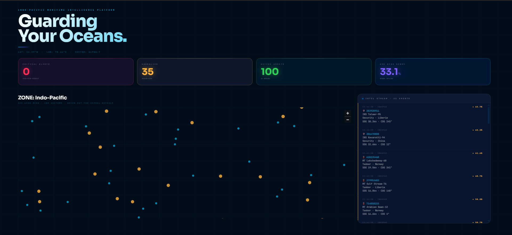

# ⚓ BLUE SENTINEL
### **Predictive Maritime Oversight // Indo-Pacific Node DL-04 // IUU Interdiction**


> <i>"The oceans are no longer a blind spot. Visibility is the ultimate weapon of sovereignty."</i>

---

## ⚡ OPERATIONAL BRIEFING
**BLUE SENTINEL** is a high-fidelity intelligence platform engineered to eliminate the "Dark Vessel" problem. Every year, **Illegal, Unreported, and Unregulated (IUU)** fishing drains $23B+ from global economies. 

This system utilizes an autonomous **LSTM (Long Short-Term Memory)** neural core to ingest live AIS telemetry, calculate behavioral risk indices, and predict vessel trajectories with tactical precision.

### 📡 SYSTEM STATUS
- [x] **Neural Engine:** LSTM weights synchronized.
- [x] **Tactical Mesh:** PyDeck/Mapbox integration live.
- [x] **Telemetry:** GSAT-7 Satellite simulation active.

---

## 🏗️ THE TECH STACK

| Category | Component |
| :--- | :--- |
| **Neural Logic** |   |
| **Interface** |   |
| **Geospatial** |   |

---

## 🧠 NEURAL ARCHITECTURE
The system processes a 10-step temporal window to detect non-linear course deviations. We utilize the **Forget Gate** to discard irrelevant historical noise while retaining critical kinetic patterns:

$$f_t = \sigma(W_f \cdot [h_{t-1}, x_t] + b_f)$$

The resulting **Cell State ($C_t$)** identifies when a vessel's behavior—loitering, zigzagging, or sudden SOG (Speed Over Ground) spikes—matches known IUU signatures.

---

## 🚀 DEPLOYMENT PROTOCOL

### **1. Local Installation (Windows/Linux/macOS)**
Clone the repository and initialize the maritime environment:
```bash
# Clone the protocol
git clone [https://github.com/Hix-001/Blue-Sentinel.git](https://github.com/Hix-001/Blue-Sentinel.git)
cd Blue-Sentinel

# Install Tactical Dependencies
pip install -r requirements.txt

# Establish Uplink
streamlit run blue_sentinel.py
```
---

## 🛰️ TACTICAL HUD PREVIEW


### 🚦 Marker Intelligence (The Mesh)
The geospatial mesh translates raw AI risk scores into visual kinetic markers. Each dot represents a live vessel tracked via GSAT-7 uplink:

* 🔵 **NOMINAL (Risk < 40%)**: Standard transit. Vessel follows established shipping lanes with consistent velocity vectors.
* 🟡 **ANOMALY (Risk 40-70%)**: Suspicious maneuvering detected. Flagged for erratic course changes or loitering near Protected Areas.
* 🔴 **CRITICAL (Risk > 70%)**: High-probability IUU signature. Matches patterns of transshipment or unauthorized extraction.

*For a detailed breakdown of current fleet assets and raw data logs, see the [Fleet Report](./telemetry/fleet_report.md).*

---

## 🚀 DEPLOYMENT COMPARISON

| Feature | Local Environment | Docker Container | Cloud (Streamlit) |
| :--- | :--- | :--- | :--- |
| **Latency** | < 10ms | 15ms | 50ms+ |
| **GPU Accel** | Native | Supported | Restricted |
| **Compute** | Laptop Hardware | Virtualized | Distributed |
| **Security** | Internal | Isolated | TLS Encrypted |

---

## 📊 DATA SCHEMA (AIS INPUT)
The Neural Core ingests the following telemetry for behavioral analysis:

| Field | Description | Format |
| :--- | :--- | :--- |
| `MMSI` | Unique Vessel ID | 9-digit Integer |
| `LAT / LON` | Geospatial Coordinates | Decimal Degrees |
| `SOG` | Speed Over Ground | Knots (float) |
| `COG` | Course Over Ground | Degrees (0-360) |
| `Class` | Vessel Category | Type Mapping |

---

## ⚖️ GOVERNANCE
This project is open-source under the **MIT License**. 
* **Contributions:** PRs are welcome for Node DL-04 expansion. 
* **Disclaimer:** This is a tactical research simulation. All naval motifs are for educational and domain awareness advocacy.

---
**Maintained by [Hix-001](https://github.com/Hix-001) // Node DL-04 // CSE Portfolio 2026**

