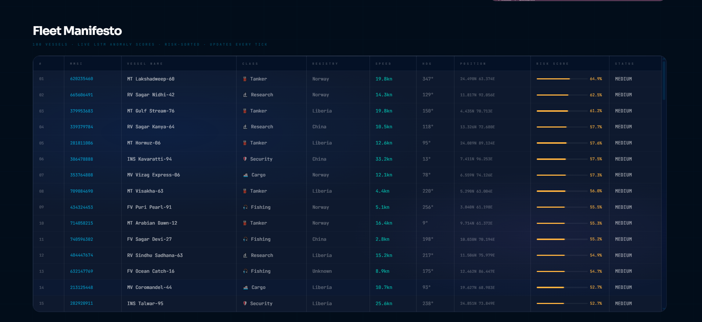

# 📊 FLEET MANIFESTO & ANALYSIS
**Snapshot Archive // Node DL-04 Telemetry**

This report contains the high-resolution breakdown of the vessel fleet mesh. While the HUD provides spatial awareness, the Manifesto provides the raw metrics used by the Neural Core for risk classification.

## 🗒️ DATA SNAPSHOT

### 🧠 Understanding the Telemetry Table
Each row in the manifesto represents a "State Snapshot" of a vessel. The AI calculates the **Risk Score** using five primary features:
1. **SOG (Speed Over Ground)**: Detecting sudden stops or high-speed escapes.
2. **COG (Course Over Ground)**: Analyzing path deviation from destination ports.
3. **MMSI Identity**: Cross-referencing against known IUU registries.
4. **Registry/Flag**: Identifying "Dark Ships" or unknown flag states.
5. **Geospatial Proximity**: Monitoring distance to Marine Protected Areas (MPAs).

### 📁 Raw Data Access
The structured data for this snapshot is archived in the same directory:
* [**inference_sample.json**](./inference_sample.json): Machine-readable JSON log few assets for system validation.

> **Note:** This is a 1-time telemetry export. Live sync occurs every 5-15 seconds depending on satellite bandwidth at Node DL-04.